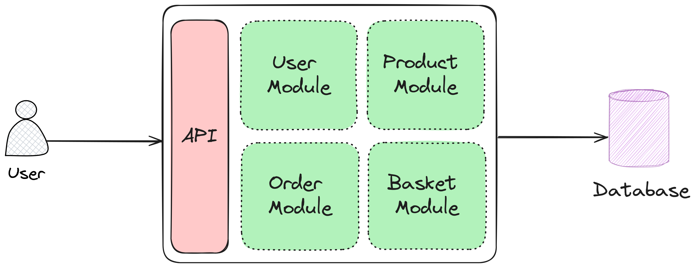

# Modulith

<p align="justify">
Modulith is a simple modular monolith architecture for building scalable and maintainable applications with .NET Core. It is a set of guidelines and best practices that help you to structure your application in a way that makes it easier to manage and scale as it grows. It is based on the principles of Domain-Driven Design (DDD) and Clean Architecture.
</p>

## Architecture

<p align="justify">
The architecture of Modulith is based on the principles of Domain-Driven Design (DDD) and Clean Architecture. It is a modular monolith architecture that allows you to break down your application into smaller, more manageable modules. Each module is a self-contained unit of functionality that can be developed, tested, and deployed independently of the other modules.
</p>

Here is an overview of the architecture of Modulith:



## Modules

- **Product**: Contains the domain logic for managing products.
- **Order**: Contains the domain logic for managing orders.
- **User**: Contains the domain logic for managing users.
- **Basket**: Contains the domain logic for managing baskets.

## Getting Started

### Prerequisites

- [.NET 8.0](https://dotnet.microsoft.com/download/dotnet/8.0)
- [Docker Desktop](https://www.docker.com/products/docker-desktop)

### Installation

1. Clone the repository and change the directory:

```bash
git clone https://github.com/foxminchan/Modulith
cd Modulith
```

2. Start the infrastructure services using Docker Compose:

```bash
docker-compose -f ./docker-compose.yml ./docker-compose.o11y.yml up -d
```

3. Run the application:

```bash
dotnet run --project src/Modulith.WebApi/Modulith.WebApi.csproj
```

## License

This project is licensed under the MIT License - see the [LICENSE](LICENSE) file for details.

## References

- [Getting Started: Modular Monoliths in .NET](https://dometrain.com/course/getting-started-modular-monoliths-in-dotnet/)
- [Deep Dive: Modular Monoliths in .NET](https://dometrain.com/course/deep-dive-modular-monoliths-in-dotnet/)
